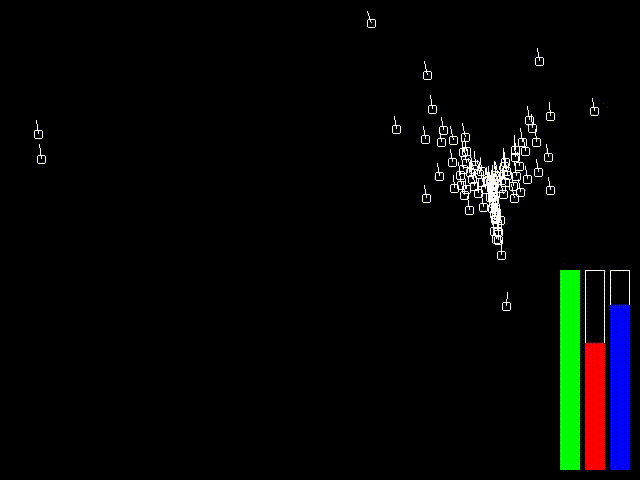

# Boids

Simulation of flock behaviour.
The sliders control the strength of each behaviour of the boids. 
In order:
- Alignment
- Separation
- Cohesion

### Notes
Thanks to [this blog](https://blog.demofox.org/2017/10/01/calculating-the-distance-between-points-in-wrap-around-toroidal-space/) for the toroidal distance calculation